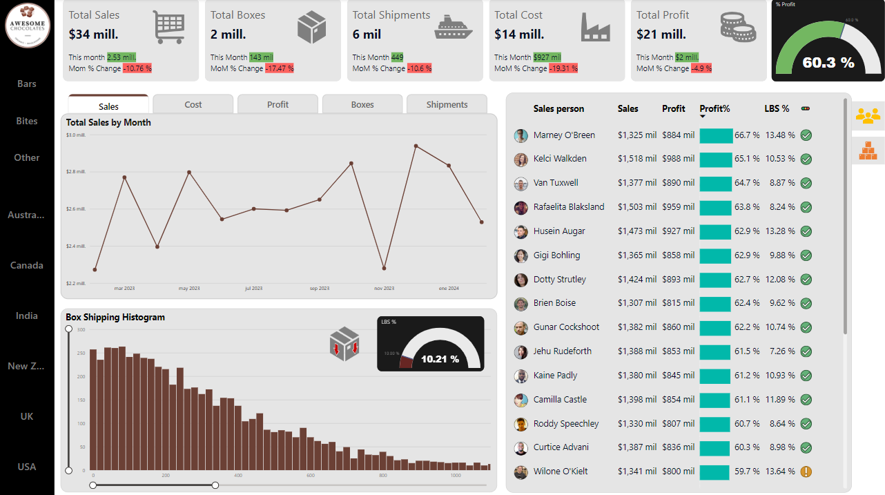

# Power BI
See the full DASHBOARD here: [App Power BI Link](https://app.powerbi.com/view?r=eyJrIjoiOTM4YzIxYzgtYmMyZC00MzdhLWE0NmQtNmIxNTMxNTRhZTM2IiwidCI6IjYxNjg1NWU4LTRhODEtNDBiMC05YmI5LTEwYWZlNGUwMDk2NiJ9)

## About the project

This dashboard is meant to create visibility for a made up Chocolate retail company called Chocolate Awesome around its transaction data: revenue, cost, quantity sold, etc. With it the manager can have visibility over the companies performance across all the countries they ship to, the products they sell, the people that work in the company and generaly the status of the company across any given point in time.

### The development of this project included
Data import, Power Query, Data modeling, DAX, Data visualization and Power BI Service.

### The development of the dashboard included
Dashboard design, time intelligence, KPI cards, reference labels, conditional formatting, tooltips, field paramaters, bookmarks, dynamic trends, grouping, histograms, zoom sliders, table design and alert icons. 

